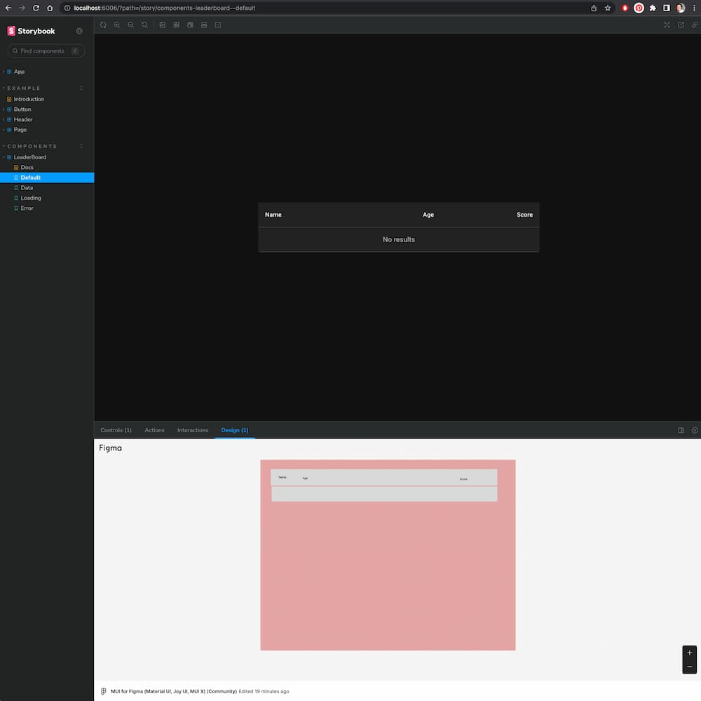
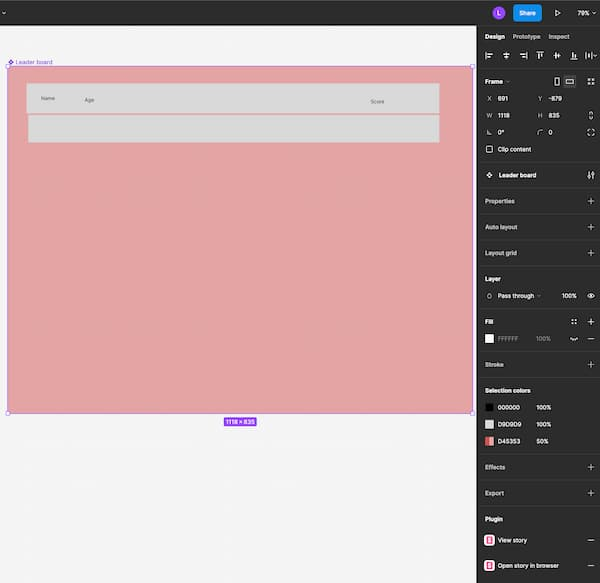

# React and Storybook 7

> A collection of stories and configs to demonstrate how Storybook can improve you and your company's velocity.

Home: [Storybook](https://storybook.js.org/)  
For detailed reasoning see [Storybook - Why](https://storybook.js.org/docs/7.0/react/get-started/why-storybook).

# Major steps

Create a React app:

```bash
npm init vite@latest vite-number-conversion -- --template react-ts
```

Initialize Storybook:

As of 2023-03-29

```bash
npx storybook@next init
```

Eventually:

```bash
npx storybook@7 init
```

## Init choices

Install: Yes! 🎉
There's not other choice required 🤩

# Running Storybook

```bash
npm run storybook
```

# Writing stories

# Common package integrations

- [Material UI](https://mui.com/)
- [react-helmet-async](https://www.npmjs.com/package/react-helmet-async)
- [react-router-dom](https://www.npmjs.com/package/react-router-dom)
  - Keep your eyes on the [React Router 6 Addon](https://storybook.js.org/addons/storybook-addon-react-router-v6)
    It does basically what I've prototyped, but well! Just waiting on a v7 release.

# Publishing for collaboration

[Storybook](https://storybook.js.org/) is amazing for working with other _developers_.  
You can and should use it to help create internal or public packages using `npm publish`.

When you start needing to work with a broader audience not code related, you need a way to publish your work
in a way they can appreciate. Sure you could ask a designer, product owner, or CEO to "clone, install and run!".
You're after better adoption though. You want the most recent result, in front of the, in something as simple as a link
in your wiki.

You _could_ publish the Storybook's built version using `npm run build-storybook` and your own CI/CD setup.

Or, you can integrate with the mother ship and get all kinds of fun tools via [Chromatic](https://www.chromatic.com/). 🚀
The folks that build Storybook are actually the open source arm of Chromatic! Using Chromatic ensures a smooth,
frictionless experience for you, and your stake holders.

You can review their totally valid sales pitch on their site, but at a high level:

> Chromatic automates gathering UI feedback, visual testing, and documentation,
> so developers can iterate faster with less manual work.

You can look forward to features like:

- Visual testing
- Approval integrations for PR's
- Automatic versioning
- And more as they are still hiring in 2023...

## GitHub + Chromatic installation

Start by getting yourself an account, then come back with a new project created.

Account and proejct id in hand, your first step is to install the Chromatic packages:

```bash
npm install --save-dev chromatic
```

From there, you can add a new script to `package.json`:

```json
{
  "scripts": {
    "chromatic": "chromatic --exit-zero-on-changes"
  }
}
```

Then wire up your CI/CID to run using:

```bash
npm run chromatic
```

Congrats, your stories are there for all your team to see! ❤️

If you visit the supplied link, you'll be suggested to wire up for tracking visual changes.
If you have the time, this is best to do now so you have the tactile understanding of what they offer.
I'll skip past it for now by clicking through and using "Go to your project" link.

The next suggestion is to setup your CI/CD, which is _critical_ to you team trusting your process.
The [docs](https://www.chromatic.com/docs/ci) are fantastic, so we'll follow along with them,
specifically, via [GitHub Actions](https://www.chromatic.com/docs/github-actions).

You'll need to setup a secret in your GitHub project. Remember the chromatic command they gave on install?
That's your token. If you need a copy, you can always go to your project > manage > configure to get it.

## Figma

For comprehensive (ish) docs, see: [Figma - Storybook and Figma](https://help.figma.com/hc/en-us/articles/360045003494-Storybook-and-Figma).

Let's start with setting your expectations. Figma integrations in either direction are _not_ designed to
translate code to bidirectionally. A story won't make components, variants, etc. A Figma frame is not code.
These integrations provide a means of _linking_ and _viewing_ the other system's output.

### Figma in Storybook 👍

A small problem due to [Unable to install beta v2 after installing Storybook v7-beta63 #185](https://github.com/storybookjs/addon-designs/issues/185).
I expect this will be sorted before June 2023.

```bash
npm install --save-dev --legacy-peer-deps storybook-addon-designs@beta
```

Otherwise it works! You'll find a "Design" tab with an embedded `<canvas />` of your design component to eyeball from.

A (terrible) Figma design loaded in Storybook:



### Storybook in Figma 👎

You'll need to be using the hosted Chromatic integrations for this. Navigate to any story, be it the Storybook or
Chromatic version, and copy the URL. You'll be able to provide that link on a component, variant, or instance.
The result will be links on the right panel to launch the Story in Figma via popup or new tab.


